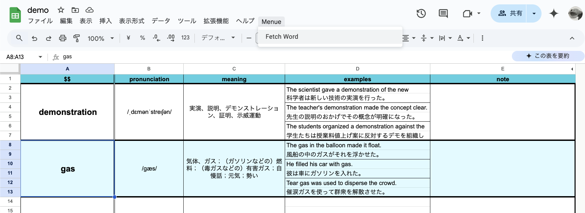
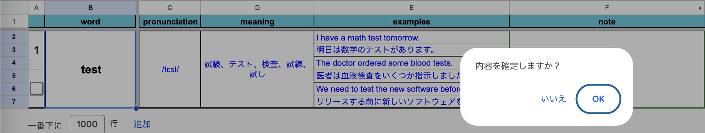

# README

この[スプレッドシート](https://docs.google.com/spreadsheets/d/1H6GYr7bxicvGNF5OTyrranghVtKn2Xm2lNbuyF9b5VQ/copy)は、語学学習者が知らない単語を効率的に検索・記録するためのツールです。以前作成したLaTeXを利用したバージョンよりも導入の負担を軽減する目的で作成されています。

任意の単語について、発音、意味、例文の情報をAI (Gemini)により生成し、それを記録します。

## 目次

1. [経緯](#経緯)
2. [機能概要](#機能概要)
3. [セットアップ手順](#セットアップ手順)
4. [基本機能](#基本機能)
5. [シートの追加](#シートの追加)

## 経緯

語学学習において、知らない単語を調べ、それを復習することは重要です。しかしこの学習法には以下のような課題が存在します：

- 調べた単語を記録し、管理するのが面倒くさい。
- 学習者が少ない言語の場合、辞書サイトによっては単語がヒットしないことがある。

本プロジェクトではこれらの課題を解決するために、以下のツールを活用。

- **[Gemini](https://ai.google.dev/)**: 40を超える言語に対応。これを用い、辞書サイトでヒットしない問題を解決を図る。
- **[GAS](https://developers.google.com/apps-script?hl=ja)**: 単語一覧を整理し、スプレッドシートに出力する。Webブラウザベースで動作するためセットアップが不要。

## 機能概要

このスプレッドシートには、以下の機能が含まれています：

- **単語またはフレーズの情報取得**: 「Fetch Word」メニューを使って、指定された単語の詳細情報をGemini APIから取得し、スプレッドシートに自動で入力します。
- **情報の表示**: 取得した情報は以下の内容で表示されます。
  1. 発音
  2. 意味
  3. 例文1 (日本語訳1)
  4. 例文2 (日本語訳2)
  5. 例文3 (日本語訳3)

    

## セットアップ手順

1. **APIキーの取得**:
   このツールは、Google Cloud の Generative Language API を使用します。APIキーを取得して、以下の手順で設定します。

   - [Google AI Studio](https://aistudio.google.com/apikey?hl=ja)にアクセス。
   - APIとサービスを有効にし、APIキーを作成します。

        

2. **シートの準備**:
    - **シートのコピーを作成**:以下のリンクからスプレッドシートをコピーして利用してください。

        [こちらからスプレッドシートをコピー](https://docs.google.com/spreadsheets/d/1H6GYr7bxicvGNF5OTyrranghVtKn2Xm2lNbuyF9b5VQ/copy)

    - **setting シート**: APIキーと使用する言語を設定します。以下の項目を設定してください：
        - `B1`: 使用する言語（例：日本語、英語）
        - `B2`: Gemini APIキー

             

    - **GASの承認手続き**:
    スクリプト実行時、GASが必要な権限の承認ダイアログが表示されます。  
    必要な権限確認し、「承認」ボタンを押します。

        

## 基本機能

1. **単語の入力**:
   - setting以外の任意の**シート**の列Aに単語を入力します。入力後、`Menue` メニューから「Fetch Word」を選択します。

       

   
2. **解説の取得**:
   - 選択した単語について、APIが辞書的な解説を取得し、次の情報を列BからDに表示します：
     - 発音、意味、例文1〜3、および日本語訳。
   
3. **内容の確認と確定**:
   - 解説が表示された後、ポップアップが表示されます。内容を確定するか、キャンセルするかを選択できます。

       

4. **内容の変更**:
   - 確定した内容は、列B〜Dに反映されます。

       

   - キャンセルした場合、内容はクリアされます。

       

## シートの追加

1. **メニュー操作**:
   - `Menue` メニューから「Add New Sheet」を選択します。

       
   - 処理が終了すると、新しいシートが追加されます。
       
2. **シート名の変更**:
   - シートの名前をお好みに変更してください
       